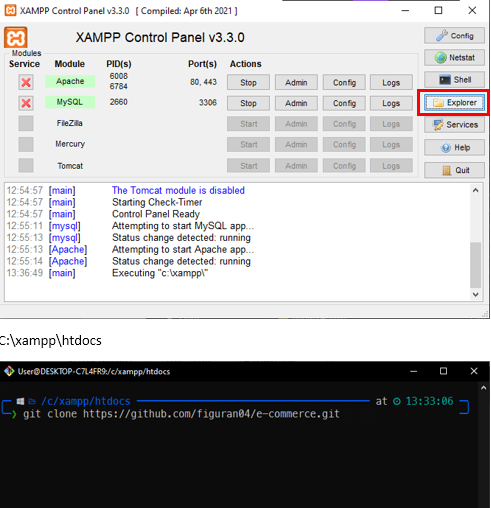
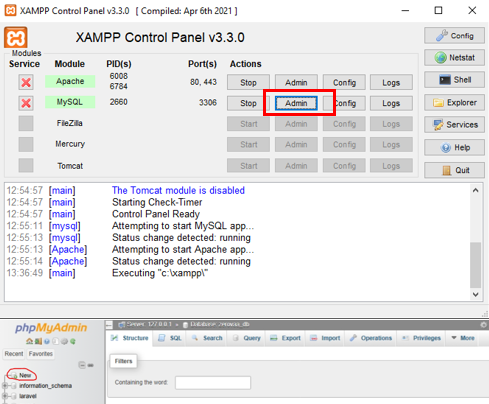
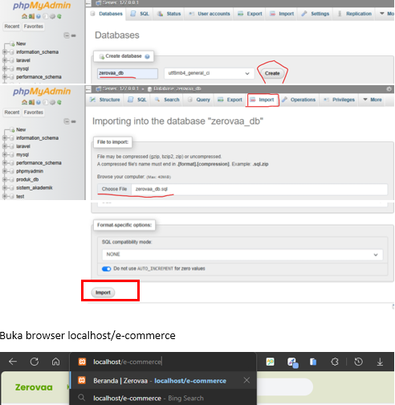
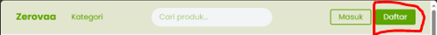
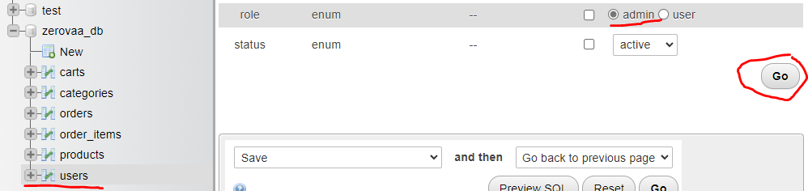

# Rekomendasi Ekstensi VSCode

`Ctrl+Shift+X`

- Auto Close Tag
- Auto rename Tag
- HTML CSS Support
- Prettier
- php intelephense
- php namespace resolver
- tailwindcss suggestion for csser
- Live Server
- Highlight Match
- CSS Peek
- Headwind
- Tailwindcss
- Codeium

http://localhost/5/e-commerce/
http://localhost/5/e-commerce/views/home
http://localhost/5/e-commerce/views/login
http://localhost/5/e-commerce/views/register

## Deploy dengan Docker

1. `docker compose up --build`
2. Buka `http://localhost:8081/`
3. Database MySQL tersedia di `localhost:3308`

Catatan:
- Aplikasi menggunakan variabel lingkungan dari `docker-compose.yml`.
- Proses setup database otomatis dijalankan saat container `app` pertama kali mulai.